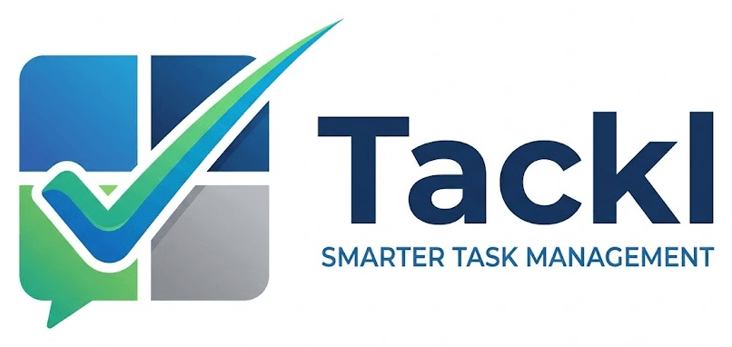

**Live at: https://tackl.nthakur.com**

A multi-user SaaS task manager for prioritizing your work with the
**[Eisenhower Matrix](https://en.wikipedia.org/wiki/Time_management#Eisenhower_method)** — the "Urgent–Important" decision grid popularized by Dwight D. Eisenhower.

Instead of filling out forms, you add tasks through a simple chat box: type what you need to do,
answer two quick questions, and the app automatically files the task into the right quadrant with a
priority number.

Tackl runs as a web app on **Google Cloud Run**, with per-user accounts via **Firebase
Authentication** and task data stored in **Firestore**.

> **Product spec & roadmap:** see [`PRODUCT_SPEC.md`](PRODUCT_SPEC.md) for the full requirements —
> what's shipped (including Delegate/Schedule/Backup, auth hardening, legal pages) and what's still
> planned (billing, teams, notifications, etc.). Keep it updated as the single source of truth when
> scope changes.
>
> **Diagrams:** see [`docs/ARCHITECTURE.md`](docs/ARCHITECTURE.md) for the system architecture,
> user flow, and data flow diagrams.

## What it does

Every task is sorted into one of four quadrants based on whether it's **important** and/or **urgent**,
and two of the quadrants connect to a real action, not just a label:

| Quadrant | Important? | Urgent? | What to do |
| --- | --- | --- | --- |
| **Q1 — Do First** | Yes | Yes | Act on these immediately |
| **Q2 — Schedule** | Yes | No | **Schedule** it — creates a real Google Calendar event |
| **Q3 — Delegate** | No | Yes | **Delegate** it — opens a pre-filled email to whoever's taking it |
| **Q4 — Eliminate** | No | No | Delete or reduce these completely |

You can also **back up** your whole list to a dedicated list in Google Tasks at any time. See
[`PRODUCT_SPEC.md` §3](PRODUCT_SPEC.md) for exactly how each integration works and its current
verification status.

## Features

- Chat-based task entry, drag-and-drop reordering/re-quadranting
- **Guest mode** — fully usable with no account, tasks stored in the browser only
- Accounts via Firebase Authentication (email/password or Google), with password reset and email
  verification
- Google integrations: Delegate (mailto), Schedule (Calendar), Backup (Google Tasks) — Google sign-in
  required for Schedule/Backup
- Self-service account deletion
- Rate limiting, input validation, error tracking, and uptime monitoring — see
  [`PRODUCT_SPEC.md` §4.2](PRODUCT_SPEC.md)

## Architecture

- **Frontend** (`src/renderer/`): plain HTML/CSS/JS, no build step. Firebase Web SDK is imported
  directly as an ES module from Google's CDN for sign-in; `api.js` talks to the backend over `fetch`,
  attaching the signed-in user's Firebase ID token. `local-store.js` mirrors the same interface
  against `localStorage` for guest mode. `google-api.js` calls the Calendar/Tasks REST APIs directly
  from the browser using a short-lived Google OAuth token.
- **Backend** (`src/server.js`): an Express server that serves the frontend as static files and
  exposes a `/api/tasks` REST API. Every request is authenticated by verifying the caller's Firebase
  ID token with the Firebase Admin SDK, then rate-limited and input-validated. Errors are reported to
  GCP Error Reporting in production.
- **Data** (`src/db.js`): Firestore, one `users/{uid}/tasks/{taskId}` collection per user, queried
  per-quadrant with a safety cap. Firestore security rules (`firestore.rules`) deny all direct client
  access — only the server (via the Admin SDK) reads or writes data, after checking the request's uid.

## Prerequisites

- [Node.js](https://nodejs.org/) 20 or later.
- A [Firebase](https://console.firebase.google.com/) project with **Firestore** and
  **Authentication** (Email/Password and, optionally, Google) enabled.
- The [gcloud CLI](https://cloud.google.com/sdk/docs/install) if you're deploying to Cloud Run.

## Local development

1. Install dependencies:

   ```bash
   npm install
   ```

2. Set up Firebase for local use:
   - In the [Firebase console](https://console.firebase.google.com/), create (or pick) a project,
     enable **Firestore** (Native mode) and **Authentication** (enable the Email/Password and Google
     sign-in providers).
   - Under Project Settings → Your apps, create a Web app and copy its config into
     `src/renderer/firebase-config.js` (these values are not secret — they identify the project, they
     don't grant access).
   - Authenticate your machine so the Admin SDK can reach Firestore/Auth:

     ```bash
     gcloud auth application-default login --project YOUR_PROJECT_ID
     ```

3. Start the server:

   ```bash
   npm run dev
   ```

   Then open <http://localhost:8080>.

> **Note:** The first time the app queries tasks, Firestore may report that a composite index is
> needed for the `getAllTasks` query (sorted by important, urgent, completed, position). Firestore's
> error message includes a direct console link to create it — click it once and the index builds in
> the background.

## Deploy to Cloud Run

**Automatic (recommended):** every push to `main` builds and deploys via the GitHub Actions
workflow at `.github/workflows/deploy.yml` — see "CI/CD" below for one-time setup.

**Manual:** with the [gcloud CLI](https://cloud.google.com/sdk/docs/install) authenticated and the
project selected:

```bash
gcloud run deploy tackl --source . --region asia-southeast1 --allow-unauthenticated
```

This builds the included `Dockerfile` and deploys it — no separate container registry step needed.
The Cloud Run service's attached service account needs the **Cloud Datastore User** (or Firebase
Admin) IAM role so the Admin SDK can reach Firestore/Auth via Application Default Credentials; no
credentials file is required on Cloud Run itself.

### Custom domain

Tackl is served at `tackl.nthakur.com` via a Cloud Run domain mapping, done once with:

```bash
gcloud beta run domain-mappings create --service=tackl --domain=tackl.nthakur.com \
  --region=asia-southeast1 --project=navalthakur
```

Then add the CNAME record it asks for (`tackl` → `ghs.googlehosted.com.`) at your DNS provider.
Google auto-provisions the TLS certificate once DNS propagates — no further action needed. The
domain also needs to be added to Firebase's authorized domains list (Authentication → Settings →
Authorized domains) or sign-in will fail with `auth/unauthorized-domain`.

Deploy the Firestore security rules once (or whenever `firestore.rules` changes) with the
[Firebase CLI](https://firebase.google.com/docs/cli):

```bash
firebase deploy --only firestore:rules --project navalthakur
```

## CI/CD

Pushes to `main` are built and deployed to Cloud Run automatically by
`.github/workflows/deploy.yml`, authenticating to GCP via **Workload Identity Federation** — no
service account key is stored in GitHub.

One-time setup (only needs to be done once, ever, by someone with owner/editor access to the GCP
project):

1. Open [Cloud Shell](https://shell.cloud.google.com) (already authenticated, no local install
   needed) and run:

   ```bash
   bash scripts/setup-gcp-ci.sh
   ```

   This enables the required APIs, creates the `tackl` Artifact Registry repo, creates a
   `github-deployer` service account scoped to this one repo, and sets up the Workload Identity
   Pool/Provider trust between GitHub Actions and GCP.

2. It prints two values at the end — add them as **repository variables** (Settings → Secrets and
   variables → Actions → Variables) in the GitHub repo:
   - `GCP_WORKLOAD_IDENTITY_PROVIDER`
   - `GCP_SERVICE_ACCOUNT`

3. Also deploy the Firestore security rules once (they're not part of the container image):

   ```bash
   firebase deploy --only firestore:rules --project navalthakur
   ```

After that, every push to `main` deploys automatically — no further setup needed.

## Monitoring & error tracking

Errors are reported to **GCP Error Reporting** automatically in production (no setup needed — it's
part of Cloud Logging, active whenever `NODE_ENV=production`, which the `Dockerfile` sets).

An **uptime check** (every 5 minutes, from multiple regions) plus an **email alert policy** were set
up once, directly in GCP, and aren't tracked in this repo:

```bash
gcloud monitoring uptime create "Tackl uptime" \
  --resource-type=uptime-url --resource-labels=host=tackl.nthakur.com,project_id=navalthakur \
  --protocol=https --path=/ --period=5 --timeout=10 --project=navalthakur

gcloud alpha monitoring channels create --display-name="Your name (email)" --type=email \
  --channel-labels=email_address=YOUR_EMAIL --project=navalthakur
```

Then create an alert policy referencing the uptime check's `check_id` and the channel above (see
Cloud Console → Monitoring → Alerting, or `gcloud alpha monitoring policies create
--policy-from-file`).

## Usage

1. Open the app — you're in **guest mode** immediately, no account needed. Sign in (top-right) any
   time to save your tasks to an account; guest tasks migrate automatically when you do.
2. Type a task in the chat box at the bottom and press **Enter**.
3. Answer **"Is this important?"** and **"Is this urgent?"** with the **Yes / No** buttons.
4. The task lands in the matching quadrant with a priority number.

Drag tasks to reorder them within a quadrant or to move them between quadrants. Hover over a task to
reveal actions to complete (✓), edit (✎), delegate (✉), schedule (📅), and delete (✕). Quadrants
scroll when they fill up.

Delegate works for everyone (opens a pre-filled email — no account needed); Schedule and the
"Backup to Google Tasks" link require signing in with Google specifically, since they call the
Calendar/Tasks APIs and need a Google OAuth token.

## Project structure

- `PRODUCT_SPEC.md` — master product specification, requirements, and roadmap
- `docs/ARCHITECTURE.md` — architecture, user flow, and data flow diagrams
- `img/` — brand assets (source logo); app favicons/icons live in `src/renderer/assets/`
- `src/server.js` — Express app: static file serving, `/api/tasks` REST routes, Firebase ID token
  verification
- `src/db.js` — Firestore data layer, scoped per user: CRUD plus quadrant move/reorder, per-quadrant
  safety cap on reads
- `src/renderer/` — frontend (HTML/CSS/JS)
  - `auth.js` — Firebase Authentication (sign in/up/out, Google sign-in, password reset, email
    verification, incremental Google OAuth scopes for Calendar/Tasks)
  - `api.js` — `fetch`-based client for the `/api/tasks` REST API (signed-in/Firestore-backed)
  - `local-store.js` — same interface as `api.js`, backed by `localStorage` (guest mode)
  - `google-api.js` — Calendar/Tasks REST API calls, made directly from the browser
  - `firebase-config.js` — Firebase web app config (fill in with your project's values)
  - `renderer.js` — auth gating, chat entry flow, drag-and-drop matrix UI, Delegate/Schedule/Backup
  - `privacy.html` / `terms.html` / `legal.css` — Privacy Policy and Terms of Service (static pages)
- `Dockerfile` — container image used for Cloud Run deploys
- `firestore.rules` / `firebase.json` — Firestore security rules (deny direct client access)
- `.github/workflows/deploy.yml` — CI/CD: builds and deploys to Cloud Run on every push to `main`
- `scripts/setup-gcp-ci.sh` — one-time script to set up the CI/CD pipeline's GCP-side resources
