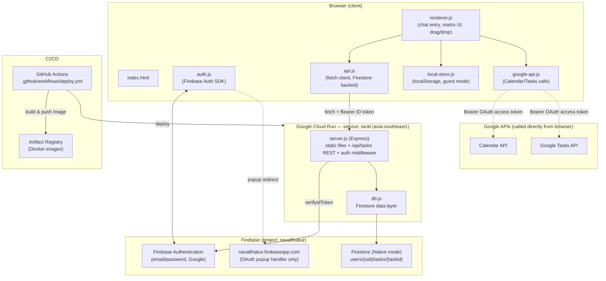
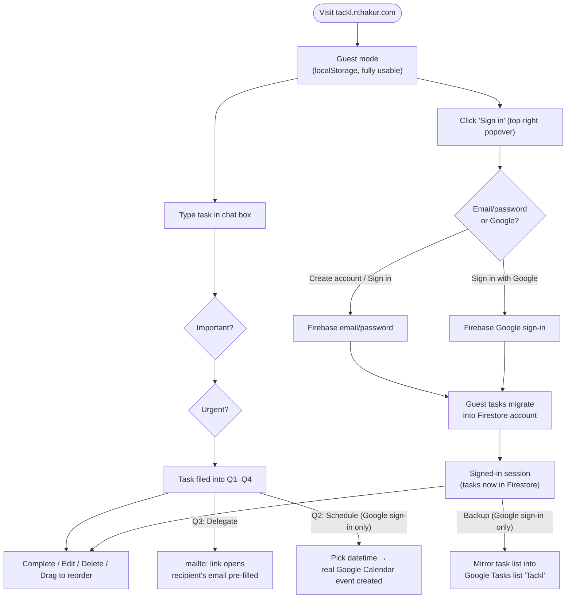
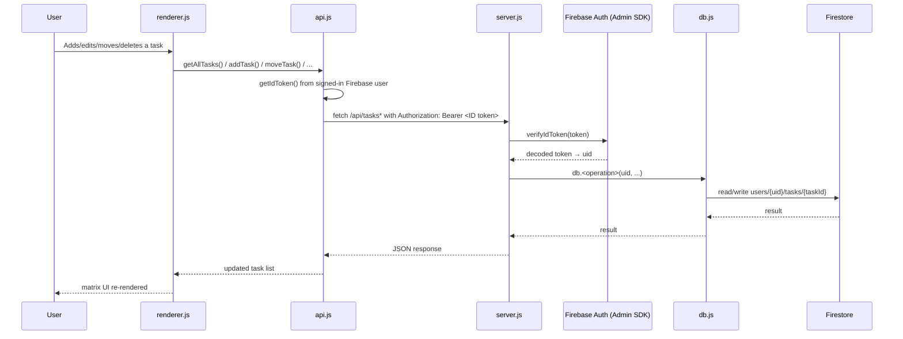
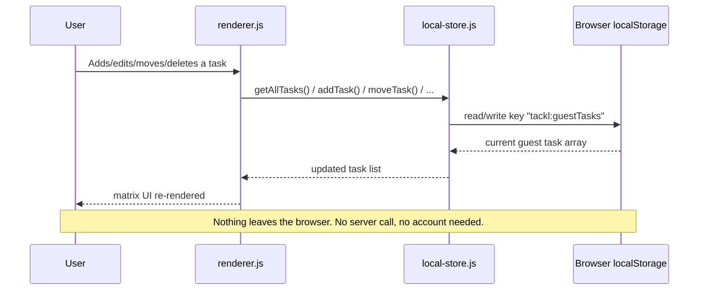
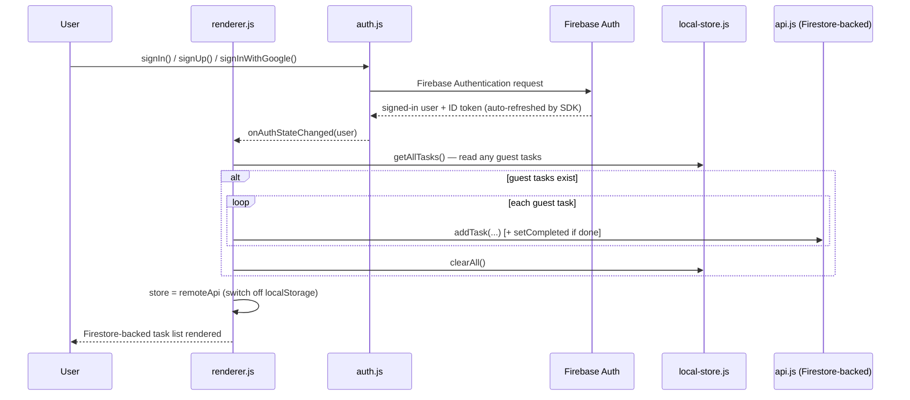
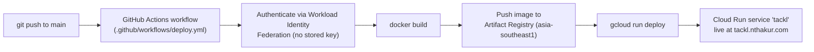
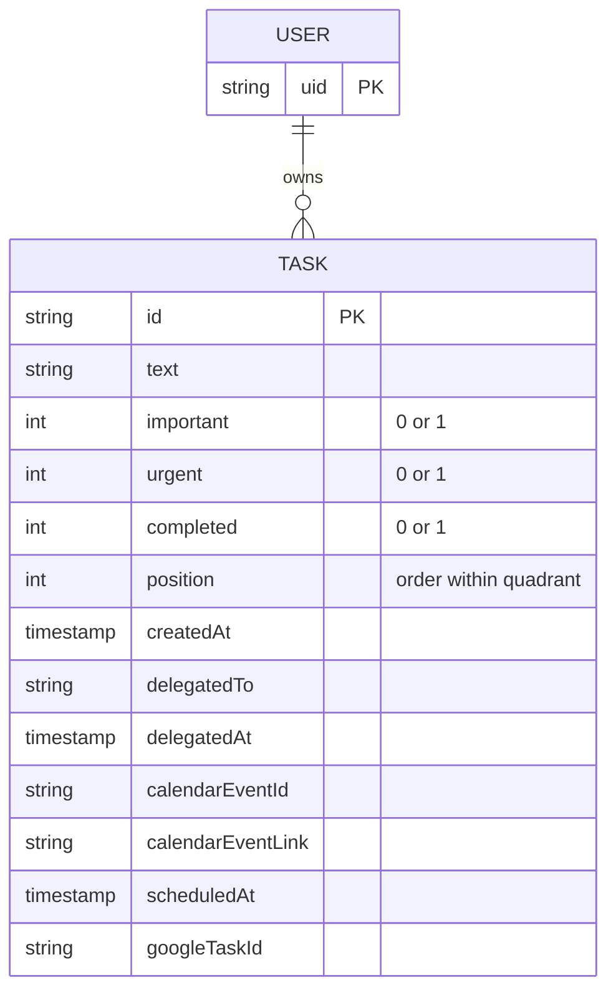

# Tackl — Architecture, User Flow & Data Flow

Companion to [`PRODUCT_SPEC.md`](../PRODUCT_SPEC.md). These diagrams are Mermaid — they render
natively on GitHub. Keep them updated alongside the spec when the architecture changes.

## 1. System architecture

**Key architectural decisions:**
- The browser **never talks to Firestore directly** — `firestore.rules` denies all direct client
  access. Every read/write goes through `server.js`, which verifies the caller's Firebase ID token
  first.
- **Guest mode is entirely client-side** (`local-store.js`, `localStorage`) — no server round-trip,
  no account needed.
- **Google Calendar/Tasks calls bypass the server entirely** — the browser calls Google's
  APIs directly with a short-lived OAuth access token. The server only persists the small resulting
  metadata (event ID, etc.) afterward.

## 2. User flow

## 3. Data flow: task CRUD (signed-in user)

## 4. Data flow: guest mode (no account)

## 5. Data flow: sign-in and guest → account migration

## 6. CI/CD pipeline

## 7. Data model (Firestore)

Path: `users/{uid}/tasks/{taskId}` — a subcollection per user, so isolation is structural, not just
rule-based (though `firestore.rules` also denies all direct client access as defense in depth).
